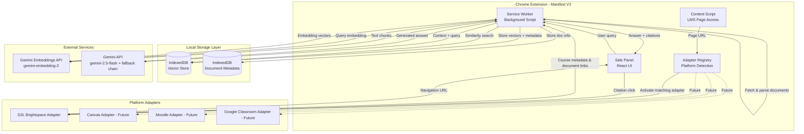
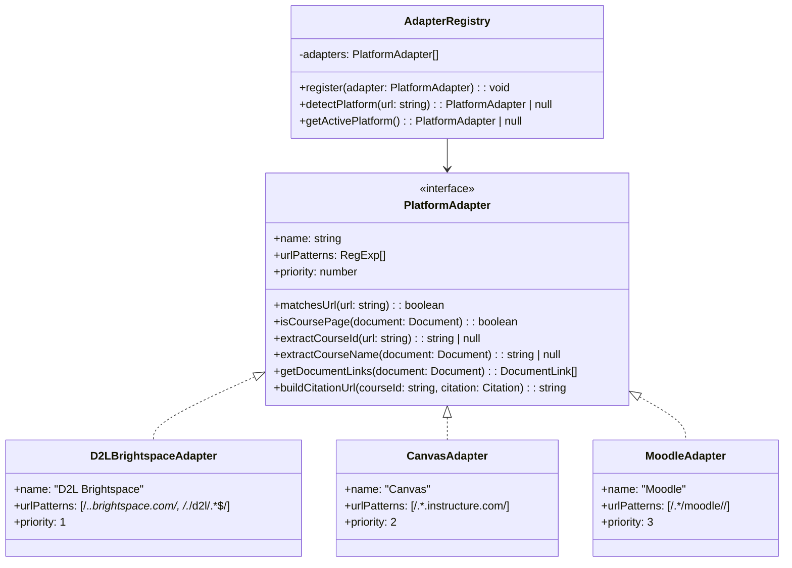
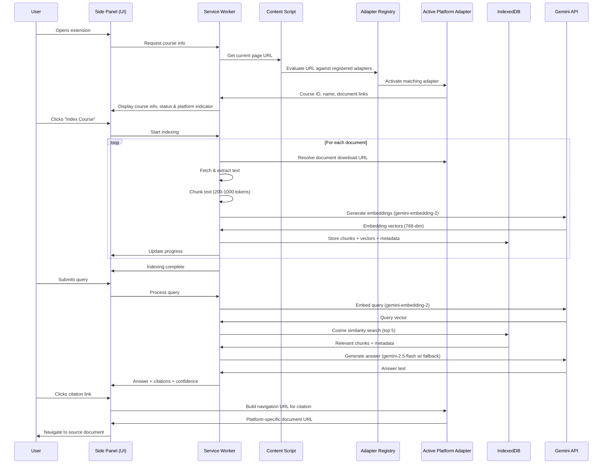
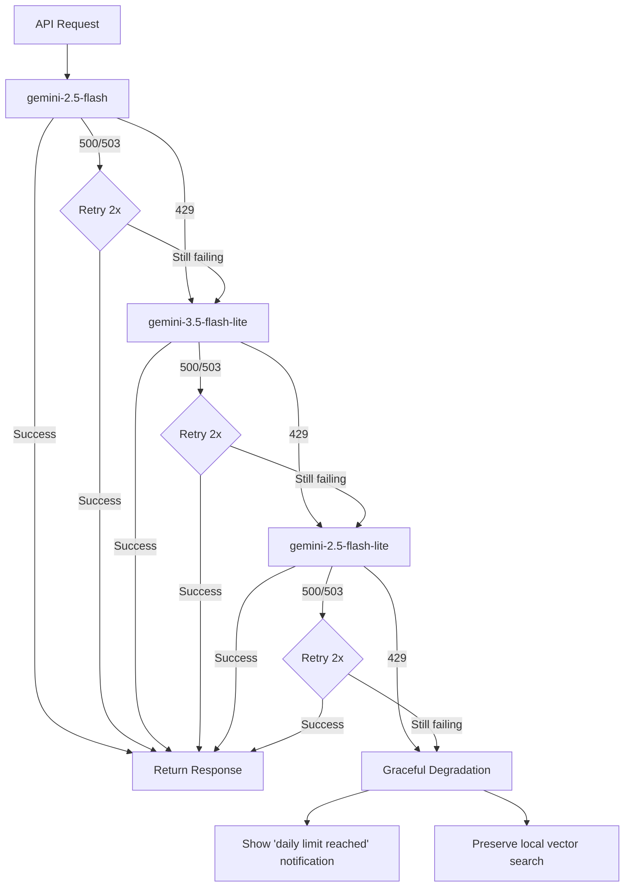

# Design Document: LMS RAG Extension

## Overview

This document describes the technical design for a browser extension that integrates a Retrieval-Augmented Generation (RAG) AI agent into university learning management systems (LMS). The extension uses a pluggable Platform_Adapter pattern to support multiple LMS platforms — shipping first with D2L Brightspace, with Canvas, Moodle, and Google Classroom adapters planned for future releases. The core extension scrapes course materials through the active Platform_Adapter, indexes them into a local vector store, and answers student questions with cited, course-grounded responses.

### Key Design Decisions

1. **Chrome Manifest V3 with Side Panel API** — The extension uses the Chrome Side Panel API for a persistent, non-intrusive UI that stays open as users navigate their LMS. This avoids content script injection conflicts with LMS platform UIs.

2. **Pluggable Platform_Adapter architecture** — All LMS-specific logic (page detection, course identification, content scraping selectors, document URL resolution, navigation for citations) is encapsulated behind a common `PlatformAdapter` interface. The core RAG pipeline, Document_Indexer, Vector_Store, and Query_Interface remain platform-agnostic. New LMS platforms can be supported by registering a new adapter without modifying core components.

3. **Gemini free-tier embedding strategy** — Embeddings are generated via Google's `gemini-embedding-2` model (768-dimensional vectors) on the Gemini API free tier. This keeps the extension lightweight (no large model downloads), completely free for users, and provides high-quality semantic search. The extension sends only small text chunks, not full documents.

4. **IndexedDB as the vector store** — Vector embeddings and document metadata are stored locally in the browser's IndexedDB. This satisfies the privacy requirement (data stays on-device) and provides up to 1GB+ of storage per origin, well within the 200MB-per-course budget.

5. **PDF.js for document extraction** — The bundled PDF.js library handles client-side PDF text extraction without requiring server-side processing. PPTX is handled by extracting embedded XML text content.

6. **Gemini 2.5 Flash with multi-model fallback** — Answers are generated using Google's Gemini API with `gemini-2.5-flash` as the primary model. A multi-model fallback chain (`gemini-2.5-flash` → `gemini-3.5-flash-lite` → `gemini-2.5-flash-lite`) ensures continued service when rate limits are hit. Each model in the chain draws from a separate quota pool. If all models are exhausted, the extension degrades gracefully — halting cloud calls, showing a "daily limit reached" notification, and preserving local vector search. On HTTP 429, the extension advances to the next model. On other errors (500, 503), it retries the same model 2× with exponential backoff before advancing. A tightly constrained system prompt limits responses to retrieved context only.

7. **Zero-configuration API access** — The extension ships with a bundled Gemini API free-tier key, requiring no account creation, API key setup, or payment from the user. There is no settings area for API key management. This removes the single biggest friction point for student adoption.

8. **Privacy-aware cloud processing** — Text chunks and queries are sent to Google's Gemini API servers for embedding and generation. All indexed data remains stored locally in IndexedDB. Users are notified on first use that content will be sent to Google for processing. Note: under the Gemini free tier, submitted content may be used by Google to improve its products per Google's API terms of service.

### Architecture Diagram



## Architecture

### Extension Runtime Model

The extension follows Chrome Manifest V3 architecture with three execution contexts:

| Context | Role | Lifecycle |
|---------|------|-----------|
| **Service Worker** | Orchestrates all background logic: document fetching, chunking, embedding, vector search, LLM calls | Event-driven, spun up on message, terminated when idle |
| **Content Script** | Injected into web pages; delegates to the active Platform_Adapter to extract course metadata, document links, and page content | Active while on pages matching any registered adapter's URL patterns |
| **Side Panel** | React-based UI for query input, answer display, indexing status, and platform indicator | Open/closed by user action |

### Platform Adapter Pattern

The extension uses an adapter registry that evaluates registered Platform_Adapters in priority order on each page load. The first adapter whose URL pattern matches the current page is activated and provides all LMS-specific logic to the rest of the system.



### Communication Flow



## Components and Interfaces

### 1. Platform Adapter Interface (`platform/adapter.ts`)

Defines the contract that all LMS platform adapters must implement. Encapsulates all platform-specific logic so core components remain agnostic.

```typescript
interface PlatformAdapter {
  /** Human-readable platform name (e.g., "D2L Brightspace", "Canvas") */
  readonly name: string;

  /** URL patterns that identify this platform (evaluated in priority order) */
  readonly urlPatterns: RegExp[];

  /** Lower number = higher priority when multiple adapters could match */
  readonly priority: number;

  /** Check if a URL belongs to this platform */
  matchesUrl(url: string): boolean;

  /** Determine if the current page is a course page (vs. login, dashboard, etc.) */
  isCoursePage(document: Document): boolean;

  /** Extract the unique course identifier from the URL */
  extractCourseId(url: string): string | null;

  /** Extract the human-readable course name from the page DOM */
  extractCourseName(document: Document): string | null;

  /** Enumerate all available course materials with download URLs */
  getDocumentLinks(document: Document): DocumentLink[];

  /** Construct a navigation URL to jump to a source document for citations */
  buildCitationUrl(courseId: string, citation: CitationMetadata): string;
}

interface CitationMetadata {
  fileName: string;
  pageNumber: number;
  sectionHeading: string;
}

interface DocumentLink {
  url: string;            // Direct download/view URL resolved by the adapter
  fileName: string;       // Document file name
  fileType: 'pdf' | 'pptx' | 'html' | 'png' | 'jpg' | 'jpeg';
  fileSize?: number;      // Size in bytes if available from the platform
  lastModified?: string;  // Last modified date if available
}
```

### 2. Adapter Registry (`platform/registry.ts`)

Manages registered Platform_Adapters and handles platform detection on page load.

```typescript
interface AdapterRegistry {
  /** Register a new platform adapter */
  register(adapter: PlatformAdapter): void;

  /** Evaluate all registered adapters against the current URL (priority order) */
  detectPlatform(url: string): PlatformAdapter | null;

  /** Return the currently active adapter (set after detection) */
  getActivePlatform(): PlatformAdapter | null;

  /** List all registered adapter names */
  getRegisteredPlatforms(): string[];
}
```

### 3. D2L Brightspace Adapter (`platform/adapters/d2l-brightspace.ts`)

The first shipped adapter, implementing the PlatformAdapter interface for D2L Brightspace instances regardless of institutional branding.

```typescript
// URL patterns cover:
// - *.brightspace.com (hosted instances)
// - */d2l/* paths (self-hosted instances like Avenue to Learn, Waterloo LEARN)
const d2lBrightspaceAdapter: PlatformAdapter = {
  name: 'D2L Brightspace',
  urlPatterns: [
    /^https:\/\/[^/]*\.brightspace\.com\//,
    /^https:\/\/[^/]*\/d2l\//
  ],
  priority: 1,

  matchesUrl(url: string): boolean { /* ... */ },
  isCoursePage(document: Document): boolean { /* ... */ },
  extractCourseId(url: string): string | null { /* ... */ },
  extractCourseName(document: Document): string | null { /* ... */ },
  getDocumentLinks(document: Document): DocumentLink[] { /* ... */ },
  buildCitationUrl(courseId: string, citation: CitationMetadata): string { /* ... */ },
};
```

### 4. Content Scraper (`content-script/scraper.ts`)

Responsible for coordinating with the active Platform_Adapter to extract course information and document links from any supported LMS page.

```typescript
interface CourseMetadata {
  courseId: string;        // Extracted by active adapter from URL
  courseName: string;     // Extracted by active adapter from page DOM
  platform: string;       // Name of the active platform adapter
  pageUrl: string;        // Current page URL
}

interface ScraperAPI {
  /** Get course metadata via the active platform adapter */
  getCourseMetadata(): CourseMetadata | null;

  /** Get document links via the active platform adapter */
  getDocumentLinks(): DocumentLink[];

  /** Check if the current page is a supported LMS course page */
  isSupportedCoursePage(): boolean;

  /** Get the name of the active platform (for UI display) */
  getActivePlatformName(): string | null;
}
```

### 5. Document Processor (`background/document-processor.ts`)

Handles document fetching, text extraction, and chunking.

```typescript
interface ExtractedDocument {
  fileName: string;
  fileType: string;
  pages: PageContent[];
  totalTokens: number;
}

interface PageContent {
  pageNumber: number;
  headings: string[];     // H1/H2 or slide titles
  text: string;
}

interface DocumentChunk {
  id: string;             // Unique chunk identifier
  courseId: string;
  fileName: string;
  pageNumber: number;
  sectionHeading: string;
  text: string;
  tokenCount: number;
  hash: string;           // Content hash for deduplication
}

interface DocumentProcessorAPI {
  fetchAndExtract(link: DocumentLink): Promise<ExtractedDocument>;
  chunkDocument(doc: ExtractedDocument, courseId: string): DocumentChunk[];
  computeDocumentHash(link: DocumentLink): Promise<string>;
}
```

### 6. Embedding Service (`background/embedding-service.ts`)

Interfaces with Google's Gemini embedding API (`gemini-embedding-2`) to convert text chunks into 768-dimensional vectors.

```typescript
interface EmbeddingResult {
  chunkId: string;
  vector: Float32Array;   // 768-dimensional vector (gemini-embedding-2)
}

interface EmbeddingServiceAPI {
  embedChunks(chunks: DocumentChunk[]): Promise<EmbeddingResult[]>;
  embedQuery(query: string): Promise<Float32Array>;
}
```

**Note:** The embedding service SHALL NOT transmit empty or zero-sized chunks to the external API. Any chunk with empty or whitespace-only text must be filtered out before transmission.
```

### 7. Vector Store (`background/vector-store.ts`)

Manages IndexedDB-backed storage and cosine similarity search.

```typescript
interface StoredVector {
  id: string;             // Same as chunk ID
  courseId: string;
  vector: Float32Array;
  metadata: ChunkMetadata;
}

interface ChunkMetadata {
  fileName: string;
  pageNumber: number;
  sectionHeading: string;
  text: string;           // Original chunk text for LLM context
  sourceType?: 'text' | 'ocr' | 'ocr-low-confidence' | 'vision'; // Content source type
}

interface SearchResult {
  chunkId: string;
  score: number;          // Cosine similarity (0.0 - 1.0)
  metadata: ChunkMetadata;
}

interface VectorStoreAPI {
  addVectors(courseId: string, vectors: StoredVector[]): Promise<void>;
  search(courseId: string, queryVector: Float32Array, topK: number): Promise<SearchResult[]>;
  getCourseStatus(courseId: string): Promise<'not_indexed' | 'indexing' | 'indexed'>;
  getCourseStats(courseId: string): Promise<{ documentCount: number; chunkCount: number }>;
  deleteCourse(courseId: string): Promise<void>;
  getStorageUsage(courseId: string): Promise<number>; // bytes
  hasDocument(courseId: string, hash: string): Promise<boolean>;
  replaceCourseIndex(courseId: string, vectors: StoredVector[]): Promise<void>;
}
```

### 8. RAG Engine (`background/rag-engine.ts`)

Orchestrates retrieval and generation to produce cited answers.

```typescript
interface Citation {
  fileName: string;
  pageNumber: number;
  sectionHeading: string;
  relevanceScore: number;
  sourceUrl?: string;     // Constructed by active Platform_Adapter's buildCitationUrl()
}

interface RAGResponse {
  answer: string;         // Markdown-formatted answer (≤300 words)
  citations: Citation[];
  confidenceScore: number; // Highest chunk similarity score
  status: 'success' | 'low_confidence' | 'insufficient_information' | 'retrieval_error';
}

interface RAGEngineAPI {
  processQuery(courseId: string, query: string): Promise<RAGResponse>;
}
```

### 9. Side Panel UI (`side-panel/`)

React-based interface with the following component hierarchy:

```
SidePanel
├── Header (course name, platform indicator, indexing status indicator)
├── IndexingPanel
│   ├── ProgressBar
│   └── IndexingControls (start/re-index buttons)
├── QueryPanel
│   ├── QueryInput (text field, 500 char limit, submit button)
│   └── AnswerHistory (scrollable list)
│       └── AnswerCard
│           ├── AnswerContent (markdown rendered)
│           ├── ConfidenceIndicator
│           └── CitationList
│               └── CitationLink
├── OnboardingOverlay (first-use guide)
├── PrivacyNotice (first-session Gemini API data notice)
└── NotificationArea (errors, warnings, rate limit / daily limit reached)
```

## Data Models

### IndexedDB Schema

The extension uses two IndexedDB databases:

**Database: `lms-rag-vectors`**

| Object Store | Key Path | Indexes | Purpose |
|---|---|---|---|
| `vectors` | `id` | `courseId`, `courseId+fileName` | Embedding vectors with metadata |
| `courses` | `courseId` | `platform` | Course status and statistics |
| `documents` | `courseId+hash` | `courseId` | Document deduplication tracking |

**Database: `lms-rag-session`**

| Object Store | Key Path | Indexes | Purpose |
|---|---|---|---|
| `history` | `id` | `courseId+sessionId` | Query/answer history per session |
| `preferences` | `key` | — | User preferences (dismissed prompts, privacy notice acknowledgment) |
| `adapters` | `name` | — | Registered adapter metadata and state |

### Key Data Structures

```typescript
// Stored in 'courses' object store
interface CourseRecord {
  courseId: string;
  courseName: string;
  platform: string;       // Name of the Platform_Adapter that detected this course
  status: 'not_indexed' | 'indexing' | 'indexed';
  documentCount: number;
  chunkCount: number;
  lastIndexedAt: string;  // ISO 8601 timestamp
  storageBytes: number;
}

// Stored in 'documents' object store
interface DocumentRecord {
  courseId: string;
  hash: string;           // SHA-256 of document content
  fileName: string;
  fileType: string;
  indexedAt: string;
  chunkCount: number;
}

// Stored in 'history' object store
interface HistoryEntry {
  id: string;
  courseId: string;
  sessionId: string;
  query: string;
  response: RAGResponse;
  timestamp: string;
}

// Stored in 'preferences' object store
interface PreferenceRecord {
  key: string;            // e.g., 'onboarding_dismissed', 'indexing_prompt_dismissed_{courseId}'
  value: boolean | string;
  updatedAt: string;
}
```

### Chunking Algorithm

```
Input: ExtractedDocument
Output: DocumentChunk[]

1. For each page in document:
   a. Split text into sentences (using regex: /[.!?]\s+/)
   b. Accumulate sentences into current chunk
   c. When current chunk reaches 200-1000 tokens:
      - If adding next sentence exceeds 1000 tokens, finalize chunk
      - Never split a sentence across chunks
   d. Attach metadata: fileName, pageNumber, nearest heading
2. Return all chunks
```

Token estimation: 1 token ≈ 4 characters (for English text). The chunker uses a simple character-based heuristic for token counting rather than a full tokenizer, which is sufficient for determining chunk boundaries.

## Correctness Properties

*A property is a characteristic or behavior that should hold true across all valid executions of a system — essentially, a formal statement about what the system should do. Properties serve as the bridge between human-readable specifications and machine-verifiable correctness guarantees.*

### Property 1: Supported document type filtering

*For any* set of document links on a page containing a mix of supported (PDF, PPTX, HTML) and unsupported file types, the Content_Scraper shall return only and all documents of supported types, with no unsupported types included and no supported types excluded.

**Validates: Requirements 1.1, 1.3**

### Property 2: Metadata preservation through chunking

*For any* extracted document with a known file name, page numbers, and section headings, every chunk produced by the Document_Indexer shall retain the correct source file name, the page number from which the chunk text originated, and the nearest section heading.

**Validates: Requirements 1.4, 2.2**

### Property 3: Document deduplication via content hash

*For any* document that has been previously indexed and whose content has not changed (same hash), re-presenting that document to the Content_Scraper shall result in no re-extraction or re-indexing of that document.

**Validates: Requirements 1.6**

### Property 4: Chunking respects token bounds and sentence integrity

*For any* input text composed of complete sentences, the Document_Indexer shall produce chunks where each chunk is between 200 and 1000 tokens, and no sentence is split across two different chunks.

**Validates: Requirements 2.1**

### Property 5: Progress indicator accuracy

*For any* set of N documents being indexed, after K documents have completed processing, the progress indicator shall report a value equal to K/N (as a percentage).

**Validates: Requirements 2.3**

### Property 6: Failure resilience preserves partial progress

*For any* ordered list of documents being processed (extracted or indexed), if processing fails at position K, all documents at positions 1 through K-1 that were successfully processed shall remain fully indexed and queryable.

**Validates: Requirements 1.5, 2.4, 9.6**

### Property 7: Indexing summary accuracy

*For any* completed indexing operation, the displayed summary counts (total documents and total chunks) shall exactly match the actual number of documents successfully processed and chunks stored in the Vector_Store.

**Validates: Requirements 2.5**

### Property 8: Top-K retrieval correctness

*For any* query vector and a Vector_Store containing N vectors (N ≥ 5), the search function shall return exactly the 5 vectors with the highest cosine similarity scores, ordered by score descending.

**Validates: Requirements 3.1**

### Property 9: Answer word count constraint

*For any* generated RAG response with status "success" or "low_confidence", the answer text shall contain no more than 300 words.

**Validates: Requirements 3.2**

### Property 10: Invalid query rejection

*For any* query string that is empty, contains only whitespace characters, or has fewer than 3 non-whitespace characters, the system shall reject the query without sending it to the RAG_Engine.

**Validates: Requirements 3.5, 6.6**

### Property 11: Citation completeness

*For any* RAG response with status "success" or "low_confidence", every citation shall include a non-empty document name, a valid page number, and a section heading.

**Validates: Requirements 4.1**

### Property 12: Confidence threshold — insufficient information

*For any* set of search results where no chunk achieves a confidence score of 0.4 or above, the RAG_Engine shall return a response with status "insufficient_information" and an empty answer.

**Validates: Requirements 4.5, 5.3**

### Property 13: Confidence threshold — low confidence warning

*For any* set of search results where the highest confidence score is at least 0.4 but below 0.6, the RAG_Engine shall return a response with status "low_confidence".

**Validates: Requirements 5.2**

### Property 14: Course context isolation

*For any* two distinct course IDs and any query, searching within one course's context shall never return chunks that belong to the other course.

**Validates: Requirements 7.1, 7.3**

### Property 15: Atomic re-indexing with rollback

*For any* course with an existing index, if re-indexing fails before completion, the original indexed content shall remain unchanged and fully queryable. If re-indexing succeeds, the new index shall completely replace the old one.

**Validates: Requirements 7.4, 7.6**

### Property 16: Query input length enforcement

*For any* string longer than 500 characters, the Query_Interface shall not accept or transmit it to the RAG_Engine.

**Validates: Requirements 6.2**

### Property 17: Unsupported page detection

*For any* URL that does not match any registered Platform_Adapter's URL patterns, the Extension shall identify it as a non-course page and disable query input.

**Validates: Requirements 6.5, 12.2**

### Property 18: Session history persistence

*For any* sequence of queries and answers recorded during a session for a given course, closing and reopening the extension within the same browser session shall retain the complete answer history.

**Validates: Requirements 6.7**

### Property 19: Dismissed prompt persistence

*For any* prompt (onboarding or indexing) that the user has dismissed, that prompt shall not be displayed again on subsequent visits, and the dismissed state shall persist across browser sessions.

**Validates: Requirements 8.5**

### Property 20: Storage limit enforcement

*For any* course whose indexed data reaches the 200MB storage limit, the Extension shall prevent further indexing for that course.

**Validates: Requirements 9.4, 9.5**

### Property 21: Course data deletion completeness

*For any* Course_Context targeted for deletion, after the delete action completes, the Vector_Store shall contain zero vectors, zero document records, and zero course records for that course ID.

**Validates: Requirements 10.6**

### Property 22: API retry and fallback behavior

*For any* request to an external AI service that fails with a server error (500, 503), the Extension shall retry that same model at most 2 additional times with exponential backoff before advancing to the next model in the fallback chain. For any request that receives HTTP 429, the Extension shall immediately advance to the next model without retrying the current one.

**Validates: Requirements 10.7, 13.4, 13.5, 13.8**

### Property 23: Chunk size constraint on API transmission

*For any* text chunk sent to an external AI service, the chunk size shall not exceed the maximum size defined by the Document_Indexer chunking configuration (1000 tokens).

**Validates: Requirements 10.3**

### Property 24: Priority-based adapter selection

*For any* set of registered Platform_Adapters with distinct priorities and any URL, the Adapter_Registry shall activate the adapter with the lowest priority number whose URL pattern matches, and shall return null if no adapter matches. Registering additional adapters shall not alter the matching behavior for previously registered adapters.

**Validates: Requirements 12.2, 12.5**

### Property 25: D2L Brightspace adapter URL recognition

*For any* URL containing a D2L Brightspace pattern (hosted `*.brightspace.com` domains or self-hosted `/d2l/` paths) regardless of subdomain or institutional branding, the D2L Brightspace adapter shall match the URL. For any URL that does not contain a D2L pattern, the adapter shall not match.

**Validates: Requirements 12.3**

### Property 26: Fallback chain exhaustion triggers graceful degradation

*For any* sequence of requests where all models in the fallback chain (`gemini-2.5-flash`, `gemini-3.5-flash-lite`, `gemini-2.5-flash-lite`) return HTTP 429 rate limit responses, the Extension shall halt all cloud API calls, display a "daily limit reached" notification, and preserve local vector search functionality so the user can still browse previously indexed data.

**Validates: Requirements 13.6**

### Property 27: Fallback chain advancement order

*For any* API request that triggers model fallback, the Extension shall attempt models in the exact order: `gemini-2.5-flash` → `gemini-3.5-flash-lite` → `gemini-2.5-flash-lite`, never skipping a model or reversing order.

**Validates: Requirements 13.4, 13.5, 13.7**

## Error Handling

### Error Categories and Responses

| Category | Trigger | User-Facing Behavior | Recovery |
|----------|---------|---------------------|----------|
| **Unsupported format** | Content_Scraper encounters unknown file type | Notification in side panel with file name and format | Skip file, continue with others |
| **Extraction failure** | PDF.js or PPTX parser throws during extraction | Error notification naming the file | Skip file, preserve partial progress |
| **Oversized document** | Document exceeds 50 MB size limit | Notification in side panel with file name and size limit info | Skip file, continue with others |
| **Embedding API failure** | Gemini Embeddings API returns 4xx/5xx or times out | Retry up to 2 times (or advance fallback chain on 429), then show error and abandon request | Preserve already-indexed content |
| **LLM API failure** | Gemini generation API fails or times out | Retry up to 2 times per model, advance fallback chain on 429, then show "unable to generate answer" | User can re-submit query |
| **Storage limit reached** | IndexedDB usage exceeds 200MB for a course | Notification indicating limit reached | Block further indexing; existing data remains queryable |
| **Re-indexing failure** | Indexer fails mid-re-index | Error with list of failed documents | Retain previous index unchanged |
| **Context creation failure** | IndexedDB fails to create new Course_Context | Error message indicating context could not be created; indexing prompt suppressed | User can retry navigation |
| **Rate limit (single model)** | Gemini API returns HTTP 429 for current model | Transparent to user — automatically advances to next model in fallback chain | Automatic fallback |
| **Rate limit (all models)** | All models in fallback chain return HTTP 429 | "Daily API limit reached" notification; cloud calls halted | Local vector search preserved; user can retry next day |
| **Network offline** | No connectivity detected | "Network unavailable" message | Queries against already-embedded data still work locally (search only) |
| **Invalid query** | Empty, whitespace-only, or < 3 chars | Inline validation message | Keep input focused for correction |
| **No course context** | Extension opened on page not matching any adapter | Guidance message to navigate to a supported LMS | Disable query input |
| **Document inaccessible** | Citation link returns 404 | "Source unavailable" message with metadata retained | Citation metadata preserved for reference |
| **Platform adapter error** | Active adapter encounters error during page detection or course identification | Platform-specific error message suggesting page refresh | User can retry by refreshing |

### Retry Strategy

```typescript
interface RetryConfig {
  maxRetries: 2;
  backoffMs: [1000, 3000];  // Exponential backoff: 1s, 3s
  retryableStatuses: [500, 502, 503, 504];  // 429 triggers fallback advancement instead
}
```

The retry logic applies to all external Gemini API calls (embeddings and generation). Non-retryable errors (400, 401, 403) fail immediately without retry. HTTP 429 responses trigger advancement to the next model in the fallback chain rather than a same-model retry.

### Model Fallback Chain

The extension implements a multi-model fallback architecture to maximize free-tier availability:

```typescript
interface ModelFallbackChain {
  /** Ordered list of models to attempt — each draws from a separate quota pool */
  models: [
    { id: 'gemini-2.5-flash', role: 'primary', capabilities: ['generation', 'vision', 'ocr'] },
    { id: 'gemini-3.5-flash-lite', role: 'first-fallback', capabilities: ['generation'] },
    { id: 'gemini-2.5-flash-lite', role: 'second-fallback', capabilities: ['generation'] },
  ];

  /** Behavior when all models return 429 */
  exhaustedBehavior: {
    haltCloudCalls: true;
    showNotification: 'daily-limit-reached';
    preserveLocalSearch: true;  // Vector search still works offline
  };

  /** Error routing logic */
  onError(status: number): 'advance' | 'retry' | 'fail';
  // 429 → 'advance' (move to next model)
  // 500, 503 → 'retry' (same model, up to 2x with backoff, then advance)
  // 400, 401, 403 → 'fail' (immediate failure, no retry or advance)
}
```



## Testing Strategy

### Property-Based Testing

The extension's core logic is well-suited to property-based testing. The following components have pure or near-pure logic that benefits from randomized input exploration:

**Library:** [fast-check](https://github.com/dubzzz/fast-check) (TypeScript PBT library)

**Configuration:**
- Minimum 100 iterations per property test
- Each test tagged with: `Feature: lms-rag-extension, Property {N}: {title}`

**Components under PBT:**
- Document chunking algorithm (token bounds, sentence integrity, metadata preservation)
- Vector similarity search (top-K correctness, course isolation)
- Confidence threshold logic (tiered response statuses)
- Input validation (query length, whitespace rejection, supported file types)
- Storage management (deduplication, limit enforcement, deletion completeness)
- Retry and fallback logic (max attempts, backoff behavior, model advancement on 429)
- Platform adapter registry (priority-based selection, URL pattern matching, additive registration)
- D2L Brightspace adapter (URL pattern recognition across institutional branding)

### Unit Tests (Example-Based)

Unit tests cover specific scenarios and edge cases not well-suited to PBT:

- UI rendering of markdown answers
- Onboarding flow (first-time display, dismissal)
- Side panel open/close toggling
- Platform indicator display in side panel header
- Course name extraction from known LMS URL patterns via adapters
- Citation navigation URL construction via Platform_Adapter
- Progress indicator display states
- Platform adapter error handling (adapter throws during page detection)
- Platform-specific error messages on adapter failure

### Integration Tests

Integration tests verify end-to-end flows with realistic data:

- Full document extraction pipeline (PDF, PPTX, HTML)
- Embedding API round-trip with real Gemini API calls
- Query-to-answer flow with a small indexed corpus (including fallback chain behavior)
- Performance benchmarks (indexing time, query response time)
- Storage consumption measurement with representative course data
- Context switching between courses
- Platform adapter detection across multiple LMS instances
- Citation navigation through adapter for each supported platform

### Test Organization

```
tests/
├── property/           # Property-based tests (fast-check)
│   ├── chunking.prop.ts
│   ├── vector-search.prop.ts
│   ├── confidence.prop.ts
│   ├── validation.prop.ts
│   ├── storage.prop.ts
│   ├── retry.prop.ts
│   ├── fallback-chain.prop.ts
│   └── platform-adapter.prop.ts
├── unit/               # Example-based unit tests
│   ├── scraper.test.ts
│   ├── rag-engine.test.ts
│   ├── side-panel.test.ts
│   ├── onboarding.test.ts
│   ├── adapter-registry.test.ts
│   └── d2l-adapter.test.ts
└── integration/        # Integration tests
    ├── indexing-flow.test.ts
    ├── query-flow.test.ts
    ├── platform-detection.test.ts
    └── performance.test.ts
```
