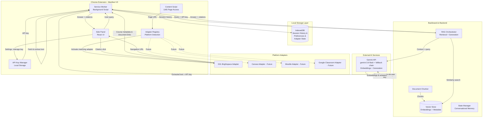
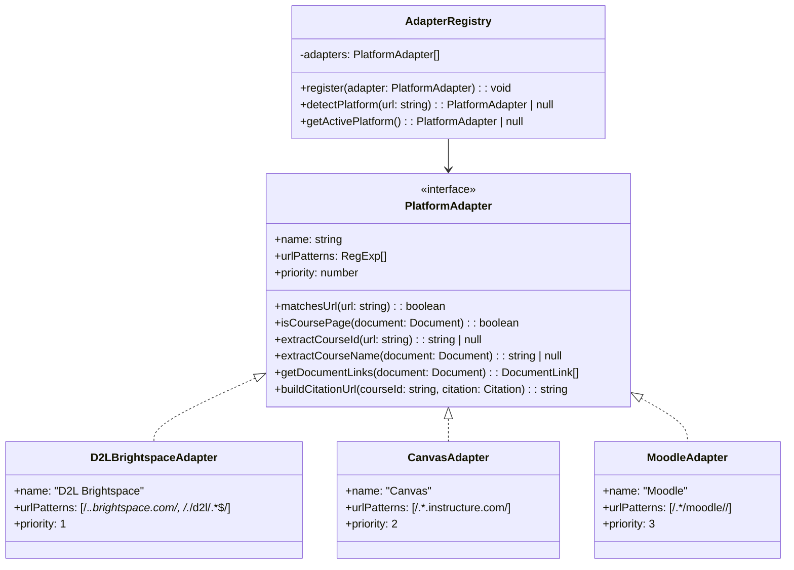
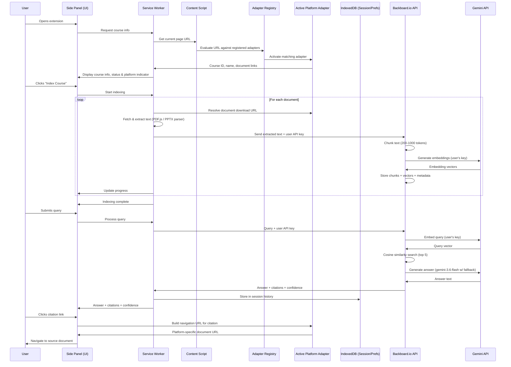
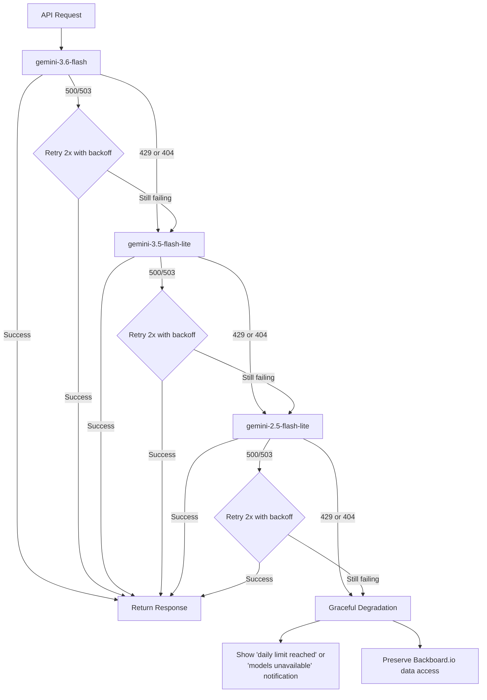

# Design Document: LMS RAG Extension

## Overview

This document describes the technical design for a browser extension that integrates a Retrieval-Augmented Generation (RAG) AI agent into university learning management systems (LMS). The extension uses a pluggable Platform_Adapter pattern to support multiple LMS platforms — shipping first with D2L Brightspace, with Canvas, Moodle, and Google Classroom adapters planned for future releases. The extension scrapes course materials through the active Platform_Adapter, sends extracted text to the Backboard.io backend for document chunking, vector storage, and RAG orchestration, and delivers cited, course-grounded responses to students via the side panel UI.

### Key Design Decisions

1. **Chrome Manifest V3 with Side Panel API** — The extension uses the Chrome Side Panel API for a persistent, non-intrusive UI that stays open as users navigate their LMS. This avoids content script injection conflicts with LMS platform UIs.

2. **Pluggable Platform_Adapter architecture** — All LMS-specific logic (page detection, course identification, content scraping selectors, document URL resolution, navigation for citations) is encapsulated behind a common `PlatformAdapter` interface. The core pipeline, Backboard_API integration, and Query_Interface remain platform-agnostic. New LMS platforms can be supported by registering a new adapter without modifying core components.

3. **Backboard.io backend for RAG orchestration** — Document chunking, vector embedding generation, vector storage, semantic similarity search, and answer generation all happen server-side on the Backboard.io platform. The extension is responsible for content scraping and transmitting extracted text to Backboard.io. This offloads compute-intensive operations from the browser, enables cross-session state persistence, and keeps the extension lightweight.

4. **BYOK (Bring Your Own Key) model** — Each user provides their personal Google Gemini API key generated via Google AI Studio. The extension stores the key securely in browser local storage, validates it during onboarding, and transmits it to Backboard.io which uses it to authenticate Gemini API requests (embeddings + generation) on behalf of the user. This achieves $0 compute cost by targeting Gemini free-tier models. A settings area lets users view (masked), update, or remove their key.

5. **IndexedDB for local session data only** — IndexedDB stores session history, user preferences (dismissed prompts, privacy notices), and adapter state. Vectors, document metadata, and chunked content are NOT stored locally — they live on Backboard.io's managed vector store.

6. **PDF.js for document extraction** — The bundled PDF.js library handles client-side PDF text extraction without requiring server-side processing. PPTX is handled by extracting embedded XML text content. Extracted text is then sent to Backboard.io for chunking and embedding.

7. **Gemini 3.6 Flash with multi-model fallback** — Answers are generated using Google's Gemini API (via Backboard.io) with `gemini-3.6-flash` as the primary frontier model. A multi-model fallback chain (`gemini-3.6-flash` → `gemini-3.5-flash-lite` → `gemini-2.5-flash-lite`) ensures continued service when rate limits are hit or endpoints are deprecated. Each model draws from a separate quota pool. Programmatic try-catch error interception in the API wrapper catches HTTP 429 (rate limit exhaustion) and HTTP 404 (deprecated/invalid endpoint) to trigger automated sequential fallback. On server errors (500, 503), the same model is retried 2× with exponential backoff before advancing. If all models are exhausted, the extension degrades gracefully — halting cloud calls, showing a "daily limit reached" notification, and preserving access to previously indexed data via Backboard.io.

8. **Privacy-aware managed processing** — Extracted text chunks and queries are transmitted to Backboard.io for processing. Backboard.io uses the user's personal Gemini API key to call Google's Gemini API for embeddings and generation. All data is associated with the user's isolated API credentials ensuring tenant separation. The extension notifies users on first use that content will be sent to external servers. Raw course content is not accessible to other platform users.

### Architecture Diagram



## Architecture

### Extension Runtime Model

The extension follows Chrome Manifest V3 architecture with three execution contexts:

| Context | Role | Lifecycle |
|---------|------|-----------|
| **Service Worker** | Orchestrates all background logic: document fetching, text extraction, communication with Backboard.io API, API key management, fallback chain logic | Event-driven, spun up on message, terminated when idle |
| **Content Script** | Injected into web pages; delegates to the active Platform_Adapter to extract course metadata, document links, and page content | Active while on pages matching any registered adapter's URL patterns |
| **Side Panel** | React-based UI for query input, answer display, indexing status, platform indicator, API key settings | Open/closed by user action |

### Platform Adapter Pattern

The extension uses an adapter registry that evaluates registered Platform_Adapters in priority order on each page load. The first adapter whose URL pattern matches the current page is activated and provides all LMS-specific logic to the rest of the system.



### Communication Flow



## Components and Interfaces

### 1. Platform Adapter Interface (`platform/adapter.ts`)

Defines the contract that all LMS platform adapters must implement. Encapsulates all platform-specific logic so core components remain agnostic.

```typescript
interface PlatformAdapter {
  /** Human-readable platform name (e.g., "D2L Brightspace", "Canvas") */
  readonly name: string;

  /** URL patterns that identify this platform (evaluated in priority order) */
  readonly urlPatterns: RegExp[];

  /** Lower number = higher priority when multiple adapters could match */
  readonly priority: number;

  /** Check if a URL belongs to this platform */
  matchesUrl(url: string): boolean;

  /** Determine if the current page is a course page (vs. login, dashboard, etc.) */
  isCoursePage(document: Document): boolean;

  /** Extract the unique course identifier from the URL */
  extractCourseId(url: string): string | null;

  /** Extract the human-readable course name from the page DOM */
  extractCourseName(document: Document): string | null;

  /** Enumerate all available course materials with download URLs */
  getDocumentLinks(document: Document): DocumentLink[];

  /** Construct a navigation URL to jump to a source document for citations */
  buildCitationUrl(courseId: string, citation: CitationMetadata): string;
}

interface CitationMetadata {
  fileName: string;
  pageNumber: number;
  sectionHeading: string;
}

interface DocumentLink {
  url: string;            // Direct download/view URL resolved by the adapter
  fileName: string;       // Document file name
  fileType: 'pdf' | 'pptx' | 'html' | 'png' | 'jpg' | 'jpeg';
  fileSize?: number;      // Size in bytes if available from the platform
  lastModified?: string;  // Last modified date if available
}
```

### 2. Adapter Registry (`platform/registry.ts`)

Manages registered Platform_Adapters and handles platform detection on page load.

```typescript
interface AdapterRegistry {
  /** Register a new platform adapter */
  register(adapter: PlatformAdapter): void;

  /** Evaluate all registered adapters against the current URL (priority order) */
  detectPlatform(url: string): PlatformAdapter | null;

  /** Return the currently active adapter (set after detection) */
  getActivePlatform(): PlatformAdapter | null;

  /** List all registered adapter names */
  getRegisteredPlatforms(): string[];
}
```

### 3. D2L Brightspace Adapter (`platform/adapters/d2l-brightspace.ts`)

The first shipped adapter, implementing the PlatformAdapter interface for D2L Brightspace instances regardless of institutional branding.

```typescript
// URL patterns cover:
// - *.brightspace.com (hosted instances)
// - */d2l/* paths (self-hosted instances like Avenue to Learn, Waterloo LEARN)
const d2lBrightspaceAdapter: PlatformAdapter = {
  name: 'D2L Brightspace',
  urlPatterns: [
    /^https:\/\/[^/]*\.brightspace\.com\//,
    /^https:\/\/[^/]*\/d2l\//
  ],
  priority: 1,

  matchesUrl(url: string): boolean { /* ... */ },
  isCoursePage(document: Document): boolean { /* ... */ },
  extractCourseId(url: string): string | null { /* ... */ },
  extractCourseName(document: Document): string | null { /* ... */ },
  getDocumentLinks(document: Document): DocumentLink[] { /* ... */ },
  buildCitationUrl(courseId: string, citation: CitationMetadata): string { /* ... */ },
};
```

### 4. Content Scraper (`content-script/scraper.ts`)

Responsible for coordinating with the active Platform_Adapter to extract course information and document links from any supported LMS page.

```typescript
interface CourseMetadata {
  courseId: string;        // Extracted by active adapter from URL
  courseName: string;     // Extracted by active adapter from page DOM
  platform: string;       // Name of the active platform adapter
  pageUrl: string;        // Current page URL
}

interface ScraperAPI {
  /** Get course metadata via the active platform adapter */
  getCourseMetadata(): CourseMetadata | null;

  /** Get document links via the active platform adapter */
  getDocumentLinks(): DocumentLink[];

  /** Check if the current page is a supported LMS course page */
  isSupportedCoursePage(): boolean;

  /** Get the name of the active platform (for UI display) */
  getActivePlatformName(): string | null;
}
```

### 5. Document Processor (`background/document-processor.ts`)

Handles document fetching and text extraction. Extracted text is sent to Backboard.io for chunking and embedding — chunking logic lives server-side.

```typescript
interface ExtractedDocument {
  fileName: string;
  fileType: string;
  pages: PageContent[];
  totalCharacters: number;
}

interface PageContent {
  pageNumber: number;
  headings: string[];     // H1/H2 or slide titles
  text: string;
}

interface DocumentProcessorAPI {
  /** Fetch document from LMS and extract raw text + structural metadata */
  fetchAndExtract(link: DocumentLink): Promise<ExtractedDocument>;

  /** Compute content hash for deduplication checks against Backboard.io */
  computeDocumentHash(link: DocumentLink): Promise<string>;
}
```

### 6. API Key Manager (`background/api-key-manager.ts`)

Manages the user's Google Gemini API key lifecycle: storage, validation, retrieval, and removal. Keys are stored in browser local storage (not IndexedDB) for simplicity and immediate access.

```typescript
interface APIKeyManager {
  /** Store a validated API key in browser local storage */
  storeKey(key: string): Promise<void>;

  /** Retrieve the stored API key (full, for transmission to Backboard.io) */
  getKey(): Promise<string | null>;

  /** Get a masked version for display (e.g., "AIza...7x9Q") */
  getMaskedKey(): Promise<string | null>;

  /** Validate the key by making a lightweight test request to Gemini API */
  validateKey(key: string): Promise<{ valid: boolean; error?: string }>;

  /** Remove the stored key */
  removeKey(): Promise<void>;

  /** Check if a valid key is configured */
  hasKey(): Promise<boolean>;
}
```

### 7. Backboard.io Client (`background/backboard-client.ts`)

Client interface for communicating with the Backboard.io backend. All chunking, embedding, vector storage, and RAG orchestration are delegated to this service.

```typescript
interface BackboardClient {
  /** Send extracted document text for chunking and indexing */
  indexDocument(params: {
    courseId: string;
    apiKey: string;
    document: ExtractedDocument;
    contentHash: string;
  }): Promise<IndexingResult>;

  /** Check if a document has already been indexed (by hash) */
  hasDocument(courseId: string, apiKey: string, hash: string): Promise<boolean>;

  /** Submit a query for RAG processing */
  query(params: {
    courseId: string;
    apiKey: string;
    queryText: string;
  }): Promise<RAGResponse>;

  /** Get course indexing status and stats */
  getCourseStatus(courseId: string, apiKey: string): Promise<CourseStatus>;

  /** Replace entire course index (for re-indexing) */
  replaceCourseIndex(courseId: string, apiKey: string, documents: ExtractedDocument[]): Promise<IndexingResult>;

  /** Delete all indexed data for a course */
  deleteCourse(courseId: string, apiKey: string): Promise<void>;
}

interface IndexingResult {
  success: boolean;
  documentsIndexed: number;
  chunksCreated: number;
  failures: Array<{ fileName: string; error: string }>;
}

interface CourseStatus {
  status: 'not_indexed' | 'indexing' | 'indexed';
  documentCount: number;
  chunkCount: number;
  lastIndexedAt?: string;
}
```

### 8. Gemini API Wrapper with Fallback (`background/gemini-wrapper.ts`)

Wraps all Gemini API calls with programmatic try-catch error interception. Catches HTTP 404 (deprecated/invalid endpoint) and HTTP 429 (rate limit exhaustion) to trigger automated sequential model fallback.

```typescript
interface GeminiWrapper {
  /** Execute a Gemini API request with automatic fallback chain */
  execute(params: {
    apiKey: string;
    prompt: string;
    taskType: 'generation' | 'embedding' | 'vision' | 'ocr';
  }): Promise<GeminiResponse>;

  /** Get the model that handled the last successful request (for logging) */
  getLastUsedModel(): string;

  /** Check if the fallback chain is exhausted */
  isExhausted(): boolean;

  /** Reset the fallback chain (e.g., after a cooldown period) */
  resetChain(): void;
}

interface GeminiResponse {
  content: string;
  model: string;        // Which model actually handled this request
  tokensUsed: number;
}

/**
 * Fallback chain implementation with try-catch error interception.
 * 
 * The wrapper catches:
 * - HTTP 404: Model endpoint deprecated or invalid → advance to next model
 * - HTTP 429: Rate limit exhausted → advance to next model
 * - HTTP 500/503: Server error → retry same model 2x with exponential backoff, then advance
 * - HTTP 400/401/403: Client error → fail immediately (no retry, no advance)
 */
const FALLBACK_CHAIN = [
  { id: 'gemini-3.6-flash', role: 'primary' as const },
  { id: 'gemini-3.5-flash-lite', role: 'first-fallback' as const },
  { id: 'gemini-2.5-flash-lite', role: 'second-fallback' as const },
];
```

### 9. RAG Engine (`background/rag-engine.ts`)

Orchestrates the query flow by coordinating between the Backboard.io client and the side panel UI. The heavy lifting (retrieval, generation) happens on Backboard.io.

```typescript
interface Citation {
  fileName: string;
  pageNumber: number;
  sectionHeading: string;
  relevanceScore: number;
  sourceUrl?: string;     // Constructed by active Platform_Adapter's buildCitationUrl()
}

interface RAGResponse {
  answer: string;         // Markdown-formatted answer (≤300 words)
  citations: Citation[];
  confidenceScore: number; // Highest chunk similarity score
  status: 'success' | 'low_confidence' | 'insufficient_information' | 'retrieval_error';
}

interface RAGEngineAPI {
  processQuery(courseId: string, query: string): Promise<RAGResponse>;
}
```

### 10. Side Panel UI (`side-panel/`)

React-based interface with the following component hierarchy:

```
SidePanel
├── Header (course name, platform indicator, indexing status indicator)
├── SettingsPanel
│   ├── APIKeyDisplay (masked key view)
│   ├── APIKeyInput (update key)
│   └── APIKeyRemoveButton (remove key)
├── IndexingPanel
│   ├── ProgressBar
│   └── IndexingControls (start/re-index buttons)
├── QueryPanel
│   ├── QueryInput (text field, 500 char limit, submit button)
│   └── AnswerHistory (scrollable list)
│       └── AnswerCard
│           ├── AnswerContent (markdown rendered)
│           ├── ConfidenceIndicator
│           └── CitationList
│               └── CitationLink
├── OnboardingOverlay (first-use guide with API key setup)
├── PrivacyNotice (first-session data transmission notice)
└── NotificationArea (errors, warnings, rate limit / daily limit reached)
```

## Data Models

### IndexedDB Schema (Local Session Data Only)

The extension uses a single IndexedDB database for local session data. Vectors, document metadata, and chunked content are stored server-side on Backboard.io.

**Database: `lms-rag-session`**

| Object Store | Key Path | Indexes | Purpose |
|---|---|---|---|
| `history` | `id` | `courseId+sessionId` | Query/answer history per session |
| `preferences` | `key` | — | User preferences (dismissed prompts, privacy notice acknowledgment) |
| `adapters` | `name` | — | Registered adapter metadata and state |

### Key Data Structures

```typescript
// Stored in 'history' object store (IndexedDB)
interface HistoryEntry {
  id: string;
  courseId: string;
  sessionId: string;
  query: string;
  response: RAGResponse;
  timestamp: string;
}

// Stored in 'preferences' object store (IndexedDB)
interface PreferenceRecord {
  key: string;            // e.g., 'onboarding_dismissed', 'indexing_prompt_dismissed_{courseId}'
  value: boolean | string;
  updatedAt: string;
}

// Stored in 'adapters' object store (IndexedDB)
interface AdapterStateRecord {
  name: string;           // Platform adapter name
  lastDetectedCourseId?: string;
  lastDetectedCourseName?: string;
  lastActiveAt: string;
}

// API Key stored in browser localStorage (not IndexedDB)
// Key: 'lms_rag_gemini_api_key'
// Value: Raw API key string (encrypted at rest by browser storage policy)

// Managed by Backboard.io (NOT stored locally)
interface BackboardCourseRecord {
  courseId: string;
  courseName: string;
  platform: string;
  status: 'not_indexed' | 'indexing' | 'indexed';
  documentCount: number;
  chunkCount: number;
  lastIndexedAt: string;
}

// Managed by Backboard.io (NOT stored locally)
interface BackboardDocumentRecord {
  courseId: string;
  hash: string;           // SHA-256 of document content
  fileName: string;
  fileType: string;
  indexedAt: string;
  chunkCount: number;
}

// Managed by Backboard.io (NOT stored locally)
interface BackboardChunkRecord {
  id: string;
  courseId: string;
  fileName: string;
  pageNumber: number;
  sectionHeading: string;
  text: string;
  tokenCount: number;
  vector: number[];       // Embedding vector
  sourceType: 'text' | 'ocr' | 'ocr-low-confidence' | 'vision';
}
```

### Chunking Algorithm (Executed on Backboard.io)

The chunking logic runs server-side on Backboard.io. The extension sends raw extracted text with page/heading metadata; Backboard.io performs the chunking:

```
Input: Extracted text with page boundaries and headings
Output: Document chunks stored in Backboard.io vector store

1. For each page in document:
   a. Split text into sentences (using regex: /[.!?]\s+/)
   b. Accumulate sentences into current chunk
   c. When current chunk reaches 200-1000 tokens:
      - If adding next sentence exceeds 1000 tokens, finalize chunk
      - Never split a sentence across chunks
   d. Attach metadata: fileName, pageNumber, nearest heading
2. Generate embedding for each chunk via Gemini API (user's key)
3. Store chunks + vectors in Backboard.io vector store
```

Token estimation: 1 token ≈ 4 characters (for English text).


## Correctness Properties

*A property is a characteristic or behavior that should hold true across all valid executions of a system — essentially, a formal statement about what the system should do. Properties serve as the bridge between human-readable specifications and machine-verifiable correctness guarantees.*

### Property 1: Supported document type filtering

*For any* set of document links on a page containing a mix of supported (PDF, PPTX, HTML, PNG, JPG, JPEG) and unsupported file types, the Content_Scraper shall return only and all documents of supported types, with no unsupported types included and no supported types excluded.

**Validates: Requirements 1.1, 1.3**

### Property 2: Metadata preservation through indexing

*For any* extracted document with a known file name, page numbers, and section headings, every chunk produced by the Document_Indexer (via Backboard.io) shall retain the correct source file name, the page number from which the chunk text originated, and the nearest section heading.

**Validates: Requirements 1.4, 2.3, 2.4**

### Property 3: Document deduplication via content hash

*For any* document that has been previously indexed and whose content has not changed (same hash), re-presenting that document to the Content_Scraper shall result in no re-extraction or re-indexing of that document.

**Validates: Requirements 1.6**

### Property 4: Chunking respects token bounds and sentence integrity

*For any* input text composed of complete sentences, the Backboard.io Document_Indexer shall produce chunks where each chunk is between 200 and 1000 tokens, and no sentence is split across two different chunks.

**Validates: Requirements 3.1**

### Property 5: Failure resilience preserves partial progress

*For any* ordered list of documents being processed, if processing fails at position K, all documents at positions 1 through K-1 that were successfully processed shall remain fully indexed and queryable on Backboard.io.

**Validates: Requirements 1.5, 3.4, 10.4**

### Property 6: Indexing summary accuracy

*For any* completed indexing operation, the displayed summary counts (total documents and total chunks) shall exactly match the actual number of documents successfully processed and chunks stored on Backboard.io.

**Validates: Requirements 3.5**

### Property 7: Progress indicator accuracy

*For any* set of N documents being indexed, after K documents have completed processing, the progress indicator shall report a value equal to K/N (as a percentage).

**Validates: Requirements 3.3**

### Property 8: Top-K retrieval correctness

*For any* query vector and a Vector_Store containing N vectors (N ≥ 5), the search function on Backboard.io shall return exactly the 5 vectors with the highest cosine similarity scores, ordered by score descending.

**Validates: Requirements 4.1**

### Property 9: Answer word count constraint

*For any* generated RAG response with status "success" or "low_confidence", the answer text shall contain no more than 300 words.

**Validates: Requirements 4.2**

### Property 10: Invalid query rejection

*For any* query string that is empty, contains only whitespace characters, or has fewer than 3 non-whitespace characters, the system shall reject the query without sending it to the RAG_Engine or Backboard.io.

**Validates: Requirements 4.6, 7.6**

### Property 11: Citation completeness

*For any* RAG response with status "success" or "low_confidence", every citation shall include a non-empty document name, a valid page number, and a section heading.

**Validates: Requirements 5.1**

### Property 12: Confidence threshold — insufficient information

*For any* set of search results where no chunk achieves a confidence score of 0.4 or above, the RAG_Engine shall return a response with status "insufficient_information" and shall not generate an answer.

**Validates: Requirements 5.5, 6.3**

### Property 13: Confidence threshold — low confidence warning

*For any* set of search results where the highest confidence score is at least 0.4 but below 0.6, the RAG_Engine shall return a response with status "low_confidence".

**Validates: Requirements 6.2**

### Property 14: Course context isolation

*For any* two distinct course IDs and any query, searching within one course's context on Backboard.io shall never return chunks that belong to the other course.

**Validates: Requirements 8.1, 8.3**

### Property 15: Atomic re-indexing with rollback

*For any* course with an existing index on Backboard.io, if re-indexing fails before completion, the original indexed content shall remain unchanged and fully queryable. If re-indexing succeeds, the new index shall completely replace the old one.

**Validates: Requirements 8.4, 8.7**

### Property 16: Query input length enforcement

*For any* string longer than 500 characters, the Query_Interface shall not accept or transmit it to the RAG_Engine.

**Validates: Requirements 7.2**

### Property 17: Unsupported page detection

*For any* URL that does not match any registered Platform_Adapter's URL patterns, the Extension shall identify it as a non-course page and disable query input.

**Validates: Requirements 7.5, 12.2**

### Property 18: Session history persistence

*For any* sequence of queries and answers recorded during a session for a given course, closing and reopening the extension within the same browser session shall retain the complete answer history in IndexedDB.

**Validates: Requirements 7.7**

### Property 19: Dismissed prompt persistence

*For any* prompt (onboarding or indexing) that the user has dismissed, that prompt shall not be displayed again on subsequent visits, and the dismissed state shall persist across browser sessions via IndexedDB preferences.

**Validates: Requirements 9.7**

### Property 20: Course data deletion completeness

*For any* Course_Context targeted for deletion, after the delete action completes on Backboard.io, the backend shall contain zero vectors, zero document records, and zero course records for that course ID.

**Validates: Requirements 11.6**

### Property 21: Chunk size and non-empty constraint on API transmission

*For any* text chunk sent to Backboard.io, the chunk size shall not exceed the maximum defined by the chunking configuration (1000 tokens), and no empty or zero-sized chunks shall be transmitted.

**Validates: Requirements 11.3**

### Property 22: Fallback chain advancement on 429/404

*For any* API request to the Gemini API that returns HTTP 429 (rate limit) or HTTP 404 (deprecated endpoint), the Extension shall immediately advance to the next model in the ordered chain: `gemini-3.6-flash` → `gemini-3.5-flash-lite` → `gemini-2.5-flash-lite`, never skipping a model or reversing order.

**Validates: Requirements 13.3, 13.4, 13.7**

### Property 23: Server error retry before advancement

*For any* request to the Gemini API that fails with a server error (HTTP 500, 503), the Extension shall retry that same model at most 2 additional times with exponential backoff before advancing to the next model in the fallback chain.

**Validates: Requirements 13.8, 11.7**

### Property 24: Fallback chain exhaustion triggers graceful degradation

*For any* sequence of requests where all models in the fallback chain (`gemini-3.6-flash`, `gemini-3.5-flash-lite`, `gemini-2.5-flash-lite`) return HTTP 429 or HTTP 404 responses, the Extension shall halt all cloud API calls, display a "daily limit reached" or "models unavailable" notification, and preserve access to previously indexed data via Backboard.io.

**Validates: Requirements 13.5**

### Property 25: Priority-based adapter selection

*For any* set of registered Platform_Adapters with distinct priorities and any URL, the Adapter_Registry shall activate the adapter with the lowest priority number whose URL pattern matches, and shall return null if no adapter matches. Registering additional adapters shall not alter the matching behavior for previously registered adapters.

**Validates: Requirements 12.2, 12.5**

### Property 26: D2L Brightspace adapter URL recognition

*For any* URL containing a D2L Brightspace pattern (hosted `*.brightspace.com` domains or self-hosted `/d2l/` paths) regardless of subdomain or institutional branding, the D2L Brightspace adapter shall match the URL. For any URL that does not contain a D2L pattern, the adapter shall not match.

**Validates: Requirements 12.3**

## Error Handling

### Error Categories and Responses

| Category | Trigger | User-Facing Behavior | Recovery |
|----------|---------|---------------------|----------|
| **API key missing** | No key configured or key removed | Onboarding prompt to enter key; indexing and query disabled | User enters valid key |
| **API key invalid** | Validation request to Gemini fails | Error message indicating invalid key; prompt to re-enter | User provides valid key |
| **Unsupported format** | Content_Scraper encounters unknown file type | Notification in side panel with file name and format | Skip file, continue with others |
| **Extraction failure** | PDF.js or PPTX parser throws during extraction | Error notification naming the file | Skip file, preserve partial progress |
| **Oversized document** | Document exceeds 50 MB | Notification identifying file and size limit | Skip document, continue with others |
| **Backboard.io failure** | Backend API returns error or times out | Error notification with failed component; preserve already-indexed content | Retry up to 2 additional times, then abandon |
| **Embedding API failure** | Gemini Embeddings API returns 4xx/5xx or times out | Retry / fallback chain logic, then show error | Preserve already-indexed content |
| **LLM API failure** | Gemini generation API fails or times out | Retry / fallback chain logic, then show "unable to generate answer" | User can re-submit query |
| **Model deprecated (404)** | Gemini endpoint returns HTTP 404 | Transparent — automatically advances to next model in fallback chain | Automatic fallback |
| **Rate limit (single model, 429)** | Gemini API returns HTTP 429 for current model | Transparent — automatically advances to next model in fallback chain | Automatic fallback |
| **Rate limit (all models)** | All models in fallback chain return HTTP 429/404 | "Daily API limit reached" or "models unavailable" notification; cloud calls halted | Access to previously indexed data via Backboard.io preserved; user can retry later |
| **Re-indexing failure** | Indexer fails mid-re-index | Error with list of failed documents | Retain previous index unchanged on Backboard.io |
| **Context creation failure** | Backboard.io fails to create new Course_Context | Error message indicating context could not be created; indexing prompt suppressed | User can retry navigation |
| **Network offline** | No connectivity detected | "Network unavailable" message | Session history accessible locally; cloud features unavailable |
| **Invalid query** | Empty, whitespace-only, or < 3 chars | Inline validation message | Keep input focused for correction |
| **No course context** | Extension opened on page not matching any adapter | Guidance message to navigate to a supported LMS | Disable query input |
| **Document inaccessible** | Citation link returns 404 | "Source unavailable" message with metadata retained | Citation metadata preserved for reference |
| **Platform adapter error** | Active adapter encounters error during page detection or course identification | Platform-specific error message suggesting page refresh | User can retry by refreshing |

### Retry Strategy

```typescript
interface RetryConfig {
  maxRetries: 2;
  backoffMs: [1000, 3000];  // Exponential backoff: 1s, 3s
  retryableStatuses: [500, 502, 503, 504];  // Server errors: retry same model
  fallbackTriggerStatuses: [429, 404];       // Rate limit / deprecated: advance to next model
  nonRetryableStatuses: [400, 401, 403];     // Client errors: fail immediately
}
```

The retry logic applies to all external Gemini API calls (via Backboard.io). Non-retryable errors (400, 401, 403) fail immediately without retry. HTTP 429 and HTTP 404 responses trigger advancement to the next model in the fallback chain rather than a same-model retry. Server errors (500, 503) trigger same-model retry with exponential backoff.

### Model Fallback Chain

The extension implements a multi-model fallback architecture with programmatic try-catch error interception in the API wrapper layer:

```typescript
interface ModelFallbackChain {
  /** Ordered list of models to attempt — each draws from a separate quota pool */
  models: [
    { id: 'gemini-3.6-flash', role: 'primary', capabilities: ['generation', 'vision', 'ocr', 'embedding'] },
    { id: 'gemini-3.5-flash-lite', role: 'first-fallback', capabilities: ['generation'] },
    { id: 'gemini-2.5-flash-lite', role: 'second-fallback', capabilities: ['generation'] },
  ];

  /** Behavior when all models return 429 or 404 */
  exhaustedBehavior: {
    haltCloudCalls: true;
    showNotification: 'daily-limit-reached' | 'models-unavailable';
    preserveBackboardAccess: true;  // Previously indexed data still accessible
  };

  /** Error routing logic (programmatic try-catch interception) */
  onError(status: number): 'advance' | 'retry' | 'fail';
  // 429 → 'advance' (move to next model — rate limit exhausted)
  // 404 → 'advance' (move to next model — deprecated/invalid endpoint)
  // 500, 503 → 'retry' (same model, up to 2x with backoff, then advance)
  // 400, 401, 403 → 'fail' (immediate failure, no retry or advance)
}
```



## Testing Strategy

### Property-Based Testing

The extension's core logic is well-suited to property-based testing. The following components have pure or near-pure logic that benefits from randomized input exploration:

**Library:** [fast-check](https://github.com/dubzzz/fast-check) (TypeScript PBT library)

**Configuration:**
- Minimum 100 iterations per property test
- Each test tagged with: `Feature: lms-rag-extension, Property {N}: {title}`

**Components under PBT:**
- Document type filtering (supported vs. unsupported file types)
- Metadata preservation through chunking pipeline
- Document deduplication (content hash matching)
- Chunking algorithm (token bounds, sentence integrity)
- Input validation (query length, whitespace rejection, char minimum)
- Confidence threshold logic (tiered response statuses)
- Course context isolation (no cross-course leakage)
- Retry and fallback logic (429/404 advancement, 500/503 retry behavior, chain exhaustion)
- Platform adapter registry (priority-based selection, URL pattern matching, additive registration)
- D2L Brightspace adapter (URL pattern recognition across institutional branding)
- Session history persistence (IndexedDB round-trip)
- Dismissed prompt persistence

### Unit Tests (Example-Based)

Unit tests cover specific scenarios and edge cases not well-suited to PBT:

- API key validation flow (valid key, invalid key, network failure)
- API key settings area (view masked, update, remove)
- Onboarding flow (first-time display, dismissal, step constraints)
- UI rendering of markdown answers
- Side panel open/close toggling
- Platform indicator display in side panel header
- Course name extraction from known LMS URL patterns via adapters
- Citation navigation URL construction via Platform_Adapter
- Progress indicator display states
- Platform adapter error handling (adapter throws during page detection)
- Platform-specific error messages on adapter failure
- Oversized document (50MB threshold) notification
- Privacy notice on first-session data transmission
- Full refresh re-extracts all materials

### Integration Tests

Integration tests verify end-to-end flows with realistic data:

- Full document extraction pipeline (PDF, PPTX, HTML) → Backboard.io indexing
- Backboard.io round-trip: index document, query, receive answer with citations
- API key validation against live Gemini API
- Fallback chain behavior with simulated 429/404/500 responses
- Query-to-answer flow with a small indexed corpus
- Performance benchmarks (indexing time, query response time)
- Context switching between courses via Backboard.io
- Platform adapter detection across multiple LMS instances
- Citation navigation through adapter for each supported platform
- Course data deletion from Backboard.io

### Test Organization

```
tests/
├── property/           # Property-based tests (fast-check)
│   ├── chunking.prop.ts
│   ├── confidence.prop.ts
│   ├── validation.prop.ts
│   ├── deduplication.prop.ts
│   ├── course-isolation.prop.ts
│   ├── fallback-chain.prop.ts
│   ├── platform-adapter.prop.ts
│   ├── session-history.prop.ts
│   └── document-filtering.prop.ts
├── unit/               # Example-based unit tests
│   ├── scraper.test.ts
│   ├── rag-engine.test.ts
│   ├── side-panel.test.ts
│   ├── onboarding.test.ts
│   ├── api-key-manager.test.ts
│   ├── adapter-registry.test.ts
│   └── d2l-adapter.test.ts
└── integration/        # Integration tests
    ├── indexing-flow.test.ts
    ├── query-flow.test.ts
    ├── backboard-integration.test.ts
    ├── platform-detection.test.ts
    ├── fallback-chain.test.ts
    └── performance.test.ts
```
