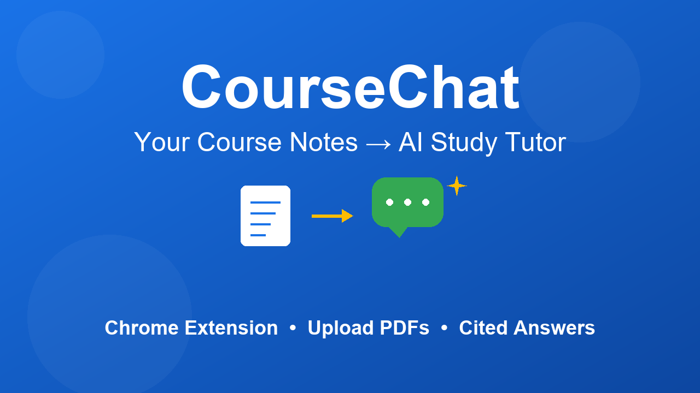
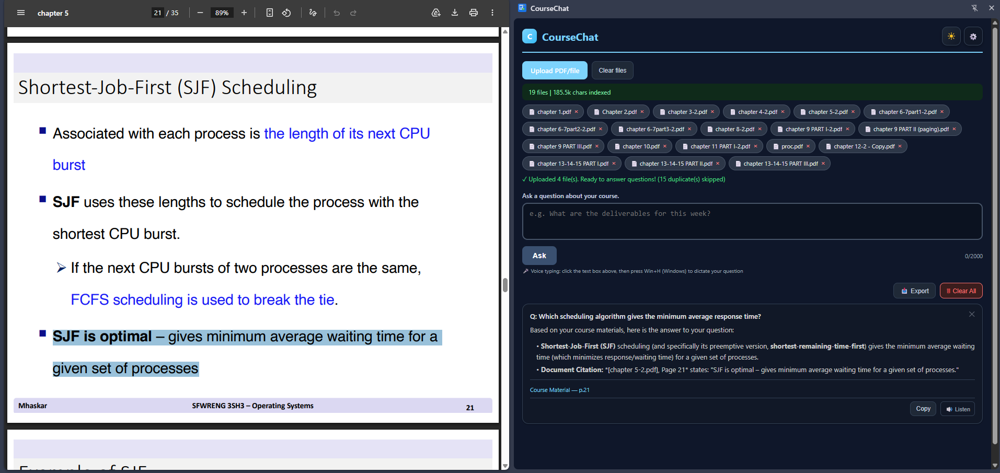
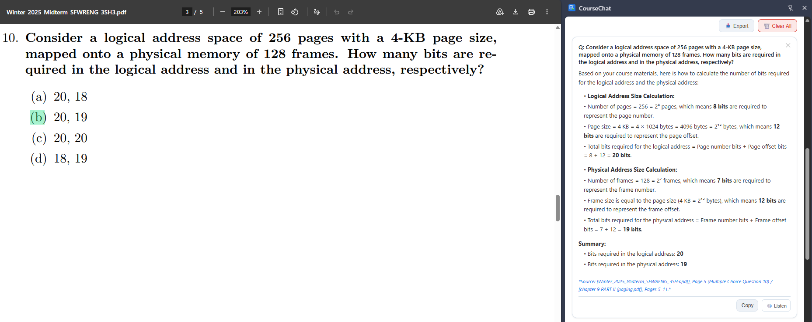
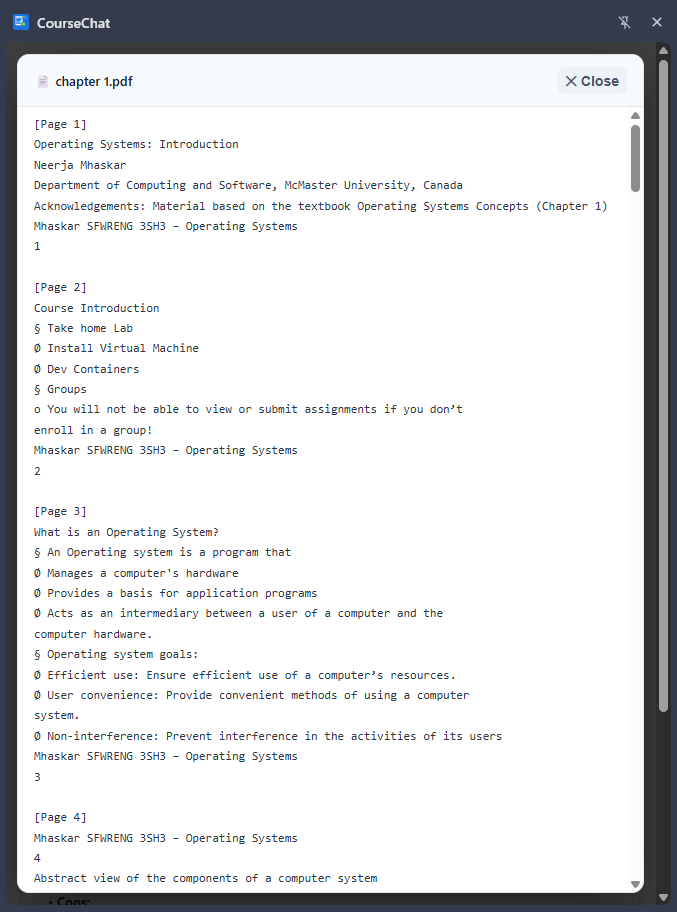
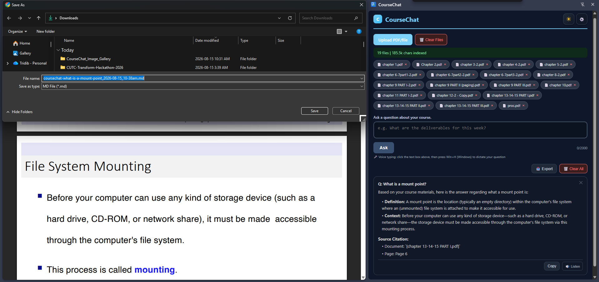

# CourseChat

A Chrome extension that turns your course materials into an AI tutor — upload lectures and exams, then ask questions and get answers with cited sources. Powered by your free Gemini API key. Zero cost.

[](https://youtu.be/eQ9ph6SMc0k)

▶️ **[Watch the Demo](https://youtu.be/eQ9ph6SMc0k)**

> 🚀 Coming soon to the Chrome Web Store as a published extension.

---

## Try It Yourself

1. **Clone and build:**
   ```bash
   git clone https://github.com/tridibbanik17/CUTC-Transform-Hackathon-2026.git
   cd CUTC-Transform-Hackathon-2026
   npm install
   npm run build
   ```

2. **Load the extension in Chrome:**
   - Go to `chrome://extensions`
   - Enable "Developer mode" (top right)
   - Click "Load unpacked"
   - Select the `dist/` folder from this repository

3. **Get a free Gemini API key:**
   - Visit [Google AI Studio](https://aistudio.google.com/apikey)
   - Create a free API key
   - Paste it into CourseChat's settings (gear icon)

4. **Test with demo files:**
   - Open CourseChat from the Chrome side panel
   - Upload PDFs from the `demo/` folder (lectures, assignments, midterm, final)
   - Ask questions like:
     - "What is the difference between monolithic and microkernel architectures?"
     - "Consider a logical address space of 256 pages with a 4-KB page size, mapped onto a physical memory of 128 frames. How many bits are required for the logical address?"
     - "Explain the bounded-buffer problem with semaphores"

---

## Features

| Feature | Description |
|---------|-------------|
| **Upload & index any course file** | 15+ formats: PDF, PPTX, DOCX, HTML, Jupyter notebooks, source code, and more |
| **Cited answers** | Every answer includes inline source references (file name, page number) |
| **LaTeX math rendering** | Mathematical notation is converted to clean Unicode (2⁸, log₂, ×) |
| **File preview** | Click any uploaded file tile to view its extracted text |
| **Dark mode** | Full dark/light theme support |
| **Export chat** | Download your entire Q&A session as Markdown |
| **Voice input** | Use OS-native voice typing (Win+H on Windows) |
| **Text-to-speech** | Listen to answers with the built-in speaker button |
| **Multi-model fallback** | If one Gemini model is rate-limited, automatically falls through to the next |
| **No document size limit** | Upload entire courses without hitting character caps |

---

## Architecture

### Browser (Chrome Extension)

- **Local text extraction** — PDF.js and format parsers pull text from documents client-side
- **React side panel** — Query input, formatted answers, file management, settings
- **API key management** — Gemini key stored securely in `chrome.storage.local`
- **Platform adapters** — Detect LMS (Brightspace, Canvas) and extract course materials automatically

### Backend (Backboard.io)

Backboard.io is the RAG orchestration backend — all compute-intensive work stays server-side:

- **Document chunking** — Splits extracted text into 200–1000 token chunks
- **Embedding generation** — Calls Gemini API with the user's key to create vectors
- **Vector storage** — Persists embeddings + metadata across sessions
- **Semantic search** — Cosine similarity to find relevant chunks for a query
- **Answer generation** — Calls Gemini with retrieved context to produce cited answers

The user's Gemini API key is passed through to Backboard.io, which makes Gemini calls on their behalf — resulting in **$0 server-side compute cost**.

### Why this split?

Chrome extensions can't efficiently store vector databases or run similarity search at scale. By offloading RAG to Backboard.io, the extension stays under 5MB, avoids IndexedDB performance issues, and gets cross-session persistence for free.

---

## Tech Stack

| Layer | Technology |
|-------|-----------|
| **Extension** | TypeScript, React, Chrome Manifest V3, Vite |
| **AI Models** | Google Gemini (gemini-3.6-flash → 3.5-flash-lite → 2.5-flash-lite) |
| **Backend** | Backboard.io (RAG orchestration, vector store) |
| **Testing** | Vitest, fast-check (property-based), 97 tests passing |
| **PDF Parsing** | PDF.js (bundled, client-side) |

---

## Supported File Types

| Format | Extraction Method |
|--------|-------------------|
| PDF (.pdf) | PDF.js — page-level text with heading detection |
| PPTX (.pptx) | ZIP/XML — slide text from `<a:t>` tags |
| DOCX (.docx) | ZIP/XML — paragraph text with heading styles |
| DOC (.doc) | Best-effort binary text scan |
| ODT (.odt) | ZIP/XML — paragraphs and headings |
| HTML (.html) | DOM parsing with script/style removal |
| Jupyter (.ipynb) | JSON — markdown + code cells |
| Plain text (.txt, .md) | Read as-is |
| Source code (.py, .java, .js, .cpp, .css) | Read as-is |
| CSV (.csv) | Read as-is |

---

## Screenshots

<table>
<tr>
<td></td>
<td></td>
</tr>
<tr>
<td></td>
<td></td>
</tr>
</table>

See all screenshots in [`CourseChat_Image_Gallery/`](./CourseChat_Image_Gallery/).

---

## Limits & Constraints

| Constraint | Value | Notes |
|------------|-------|-------|
| **Document content** | No limit | Backboard handles chunking server-side |
| **Query input** | 2,000 characters | Long, detailed questions welcome |
| **Answer length** | Up to 1,000 words | Complex questions get thorough answers |
| **Per-file size** | 50 MB | Browser memory guard |
| **Re-index timeout** | 15 minutes | Safety cap for large course re-indexing |
| **Gemini fallback chain** | 3 models | Auto-advances on rate limit (429) or deprecation (404) |

---

## Known Limitations

| Limitation | Reason |
|------------|--------|
| Cannot read diagrams/figures/charts | Images in PDFs are pixels, not text — requires vision AI |
| Cannot process videos/audio | Would need transcription service |
| Cannot read handwritten/scanned notes | Scanned PDFs contain images, not text characters |
| Legacy .doc extraction is imperfect | Binary OLE2 format without a full parser |
| No .xlsx, .ppt, .key support | Each needs a separate parser — post-hackathon |
| Answers limited to indexed content | By design — no hallucination beyond source material |

---

## Development

```bash
# Install dependencies
npm install

# Build the extension
npm run build

# Run tests (97 passing)
npm test

# Build outputs to dist/ — load this folder in Chrome
```

---

## Team

| Member | Role | Key Contributions |
|--------|------|-------------------|
| **Tridib** (@tridibbanik17) | Architecture & Integration | Project scaffolding, API key manager, Backboard client, service worker, final integration |
| **Taksh** (@takshp2024-sys) | AI/Backend Logic | Gemini wrapper, RAG engine, indexing orchestrator, Backboard integration |
| **Bhagya** (@BhagyaV3) | Frontend/UI | Side panel UI, query panel, formatted answers, notifications, onboarding |
| **Hunza** (@huna-mathophile) | Data Pipeline | Platform adapters, document processor, content extraction |

See [CONTRIBUTING.md](./CONTRIBUTING.md) for detailed workflow and task breakdown.

---

## License

Built for [CUTC Transform Hackathon 2026](https://cutc.ca/).
